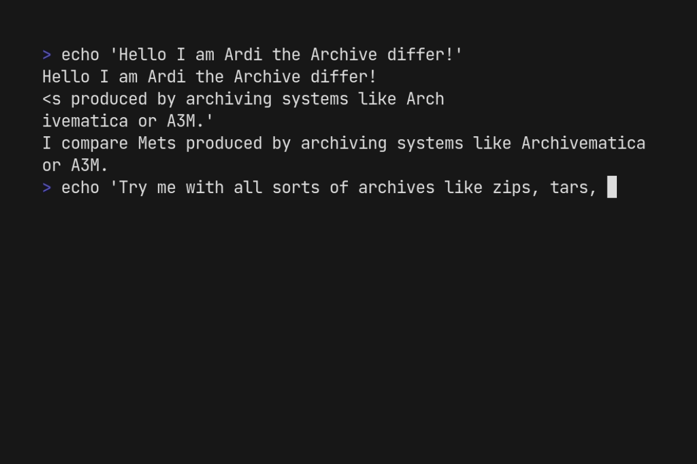

# Ardi the Archive-differ

The archive differ is an application that takes an archived bag in the Bagit
format, and checks the [METS](https://www.loc.gov/standards/mets/) file for difference in comparison to another bag.
If there are differences between the preservation steps (outlined in the [PREMIS](https://www.loc.gov/standards/premis/)) it will display the difference that bags have to
the user in a useful and readable format.

## Installation

Before installing, please ensure that you have Go installed on
your machine. You can download it from the official [Go Download
Page](https://golang.org/dl/).

You can install the binary quickly with:

```sh
go install github.com/Diogenesoftoronto/ardi@latest
```

### Installation from source

Clone the repository to your local machine, or download the source code as a zip:
```sh
git clone https://github.com/Diogenesoftoronto/ardi
```
Navigate into the project directory:

```sh
cd repository
```

Install the necessary dependencies:

```sh
go mod tidy
```

Build the application:

```sh
go build
```

## Features

The first focus is to display the difference and counts of the preservation
events.  It will also give users the output of the diff tag if asked for.

The tool may also do other things given time.

## Usage

The archive differ is primarly a command line tool although in the future
if it proves useful, it's feature set may include a text user interface.

To use the application, run the following command with your METS file paths
as arguments:

* This assumes you have added ardi to your PATH variable. 
```sh
ardi path1/to/metsfile.xml path2/to/metsfile.xml
```

Ardi works with tars, zips, and sevenzips. But not directories. You can give
Ardi compressed files and it will find the Mets and compare on its own.
Ardi can do multiple diffs at the same time but just make sure that you
are giving Ardi a multiple of two. Otherwise it wont be able to compare the
odd one.

To add ardi to your path please do this for the bash shell:

```sh
export PATH=$PATH:/path/to/ardi/bin
```

Adding variables to the fish shell is even easier:

```fish
fish_add_path ardi /path/to/ardi/bin
```
## Motivation 

The reason this exists is to test different digital archiving
tools to see if they produce the same types of preservation metadata in a
quick way without resorting to human error and intense labour.

The primary applications it is meant to test is the a3m and archivematica
Archival Information Packages.
